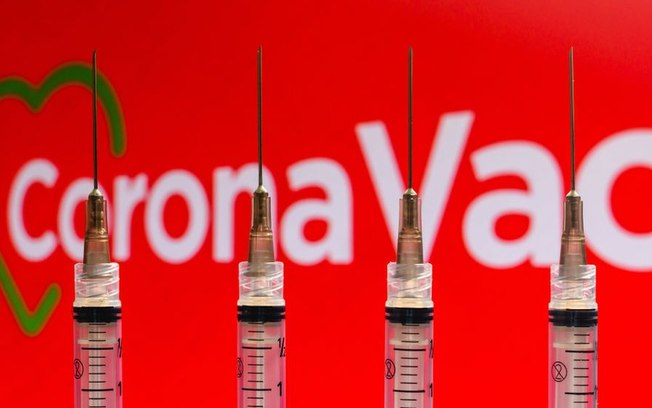

# Panoramas da Pandemia do COVID-19 no Brasil - Vacina, Casos e Mortes 

  

O COVID-19 é um vírus que pegou todo o planeta de surpresa, pois mesmo em comparativo com outros Corona Vírus, ele tem comportamento bem diferente para o que a sociedade estava acostumada de uma doença viral.  A luz no fim do túnel que todo mundo estava aguardando era a vacina, que vinha sendo desenvolvida incansávelmente por várias iniciatiavas ao redor do planeta. Após muitos dias de espera e trabalho árduo desses pesquisadores, no dia 08 de Dezembro de 2021, Margaret Keenan, uma britânica de 90 anos, tornou-se a primeira pessoa no mundo a receber a vacina da Pfizer contra a Covid-19 fora de um ensaio clínico. 

Logo após esse dia histórico, outras vacinas foram sendo testadas e aprovadas para o uso na população, dando início ao fim da Pandemia do COVID-19.  Todos os países trataram a pandemia de maneira diferente e como vimos nas características acima citadas, comparações entre práticas de combate ao vírus não são simples de serem feitas, logo precisamos entender como foi e como está o panorama da Pandemia no Brasil e em outros países para buscarmos encontrar diferenças pontuais que possam nos dizer algo sobre a pandemia e seu esperado fim com a expansão das campanhas de vacinação.  

Nesta análise vamos explorar os dados sobre a vacina do COVID-19 para entender como a vacinação vem se comportando nos países para entender quem vem tendo bons resultados e quem ainda precisa melhorar suas políticas.
